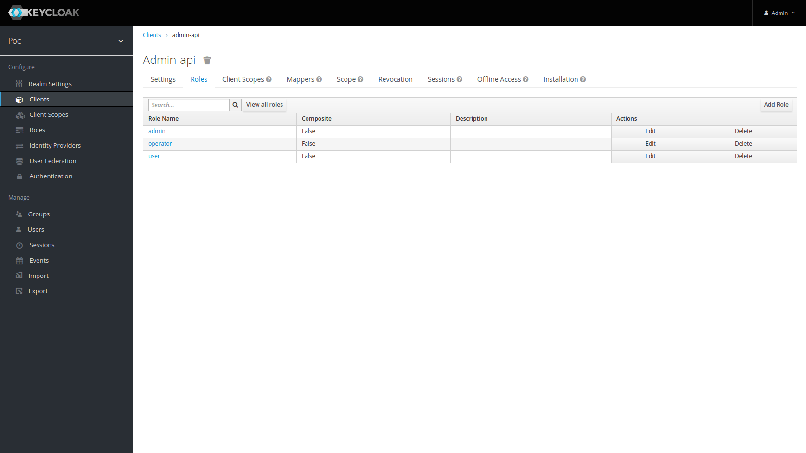
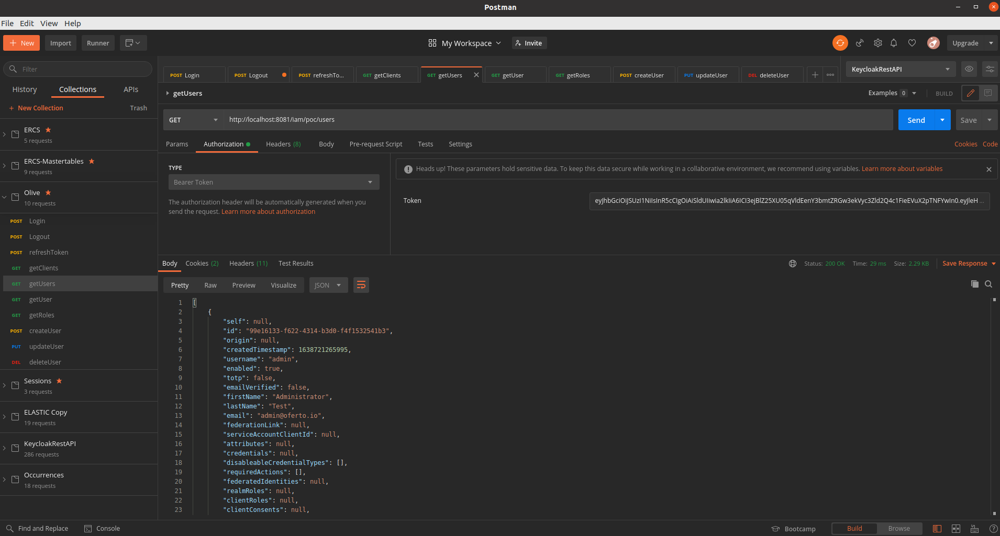
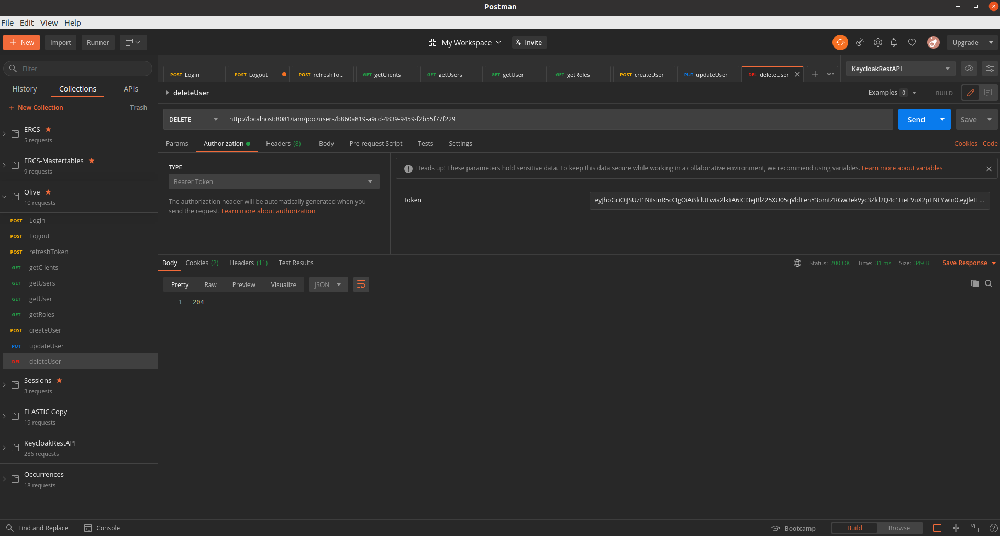

# Description
Poc Keycloak Authentication/Authorization SpringBoot Microservice

# Keycloak resources: realm, client, roles and users

## Create realm

- **Name**: poc


## Create client

- **Name**: test
- **Root URL**: http://localhost:8081 (This is the domain where microservice is running)


## Create client roles
Inside the client we created these roles:

- **name**: admin, operator, user



## Create users
- **name**: admin with roles: **admin** in **poc** client and **all roles** in **realm-management** client
- **name**: operator with role: **operator** in **poc** client
- **name**: user with role: **user** in **poc** client


The **admin** user has **admin** rol in **poc** client and **all roles** from **realm-manager** client


## Client configuration
We could obtain the client configuration from client to used insides springboot microserice


## Test Login with curl
```shell
curl -d 'client_id=admin-cli' -d 'username=<USERNAME>' -d 'password=<PASSWORD>' -d 'grant_type=password' 'http://localhost:8080/auth/realms/<CLIENT_ID>/protocol/openid-connect/token' | python -m json.tool
```

## Test Login with postman
Postman login inside test realm with the credentials user/user


## Test Logout with curl
```shell
curl -d 'client_id=admin-cli' -d 'refresh_token=<REFRESH_TOKEN>' 'http://localhost:8080/auth/realms/<CLIENT_ID>/protocol/openid-connect/logout'
```

## Test Logout with Postman
Postman login inside test realm with the credentials user/user


## Test Get Users from realm with Postman



## Test Create User from realm with Postman


## Test Update User from realm with Postman


## Test Delete User from realm with Postman



## Test get clients from realm with Postman

