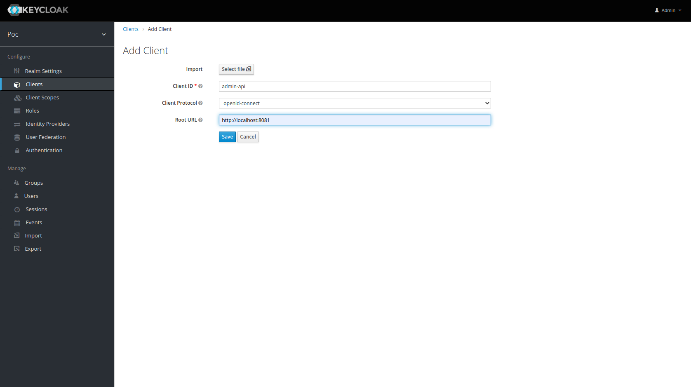
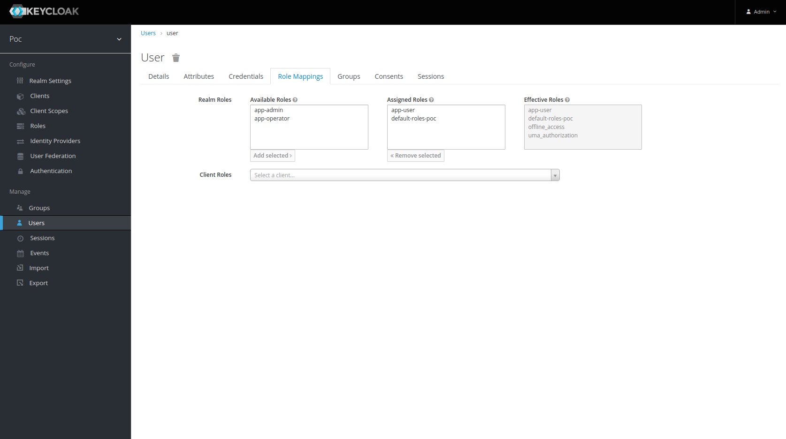
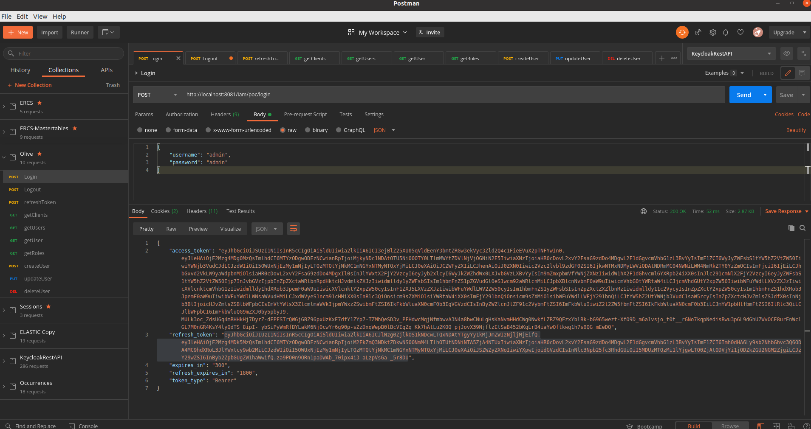
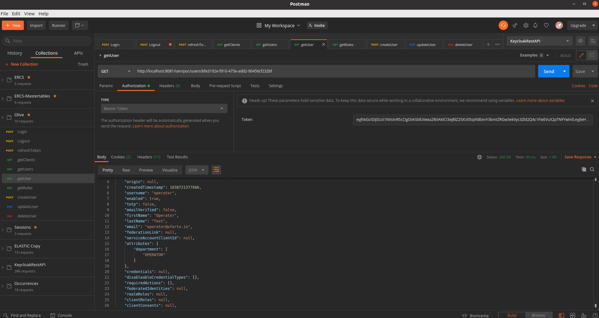

# Description
Poc Keycloak Authentication/Authorization SpringBoot Microservice

# Keycloak resources: realm, client, roles and users

## Create realm

- **Name**: poc


## Create client

- **Name**: admin-api
- **Root URL**: http://localhost:8081 (This is the domain where microservice is running)



## Create client roles
We must create each roles inside all microservices. These are all common roles inside each client:

- **name**: admin, operator, user


## Create realm roles
We are going to group all common client roles inside realm composite roles to assign then to users easily. Only for **admin** user we will add all roles from the client **real-manager** client to access keycloak admin api (user/role management)


## Create users
- **name**: **admin** with composite realm role: **app-admin** and **all roles** in **realm-management** client
- **name**: **operator** with composite realm role: **app-operator**
- **name**: **user** with composite realm role: **app-user**

The **admin** user has **app-admin** realm role and **all roles** from **realm-manager** client


The **user** user has **app-user** realm role only



## Client configuration
We could obtain the client configuration from client to used inside spring boot microservice


## Test Login with curl
```shell
curl -d 'client_id=admin-cli' -d 'username=<USERNAME>' -d 'password=<PASSWORD>' -d 'grant_type=password' 'http://localhost:8080/auth/realms/<CLIENT_ID>/protocol/openid-connect/token' | python -m json.tool
```

## Test Login with postman
Postman login inside test realm with the credentials user/user



## Test Refresh Token with postman
Postman refresh token test realm with from the old refresh token


## Test Logout with curl
```shell
curl -d 'client_id=admin-cli' -d 'refresh_token=<REFRESH_TOKEN>' 'http://localhost:8080/auth/realms/<CLIENT_ID>/protocol/openid-connect/logout'
```

## Test Logout with Postman
Postman login inside test realm with the credentials user/user


## Test Get clients from realm with Postman
This endpoint it's securized with **access token** and **admin, operator** role


## Test Get all users from realm with Postman
This endpoint it's securized with **access token** and **admin, operator** role


## Test Get a user from realm with Postman
This endpoint it's securized with **access token** and **admin** role



## Test Get roles By user from realm with Postman
This endpoint it's securized with **access token** and **admin, operator** role


## Test Create user from realm with Postman
This endpoint it's securized with **access token** and **admin** role


## Test Update user from realm with Postman
This endpoint it's securized with **access token** and **admin** role


## Test Remove user from realm with Postman
This endpoint it's securized with **access token** and **admin** role

