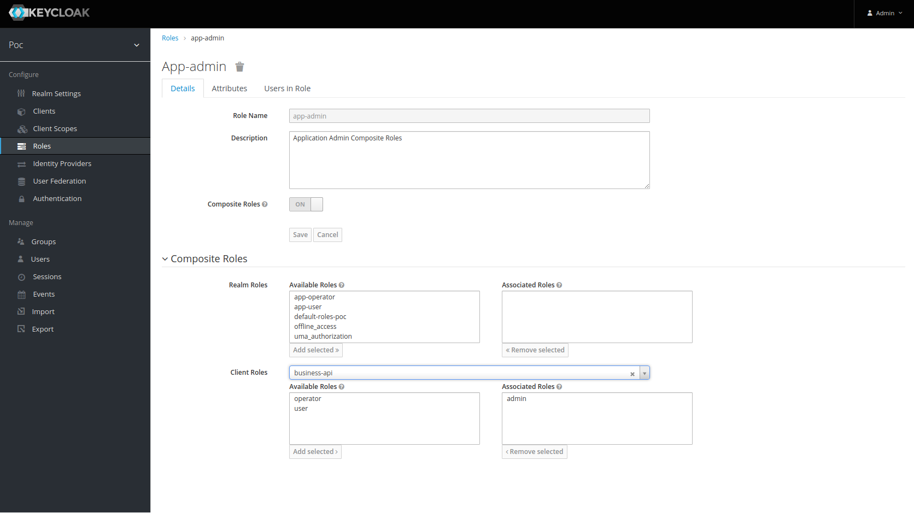
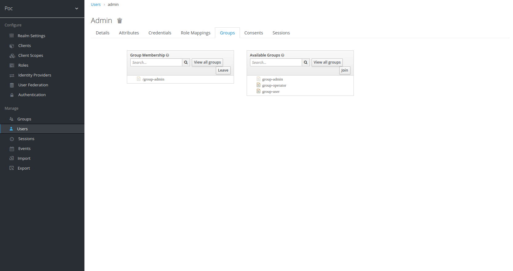

# Description
Poc Keycloak Authentication/Authorization SpringBoot Microservice

# Keycloak resources: realm, client, roles and users

## Create realm

The realm represent the organization security group where we will create: users, roles, groups and clients

- **Name**: poc


## Create clients

- **Name**: admin-api
- **Root URL**: http://localhost:8081 (This is the domain where security microservice is running)


## Create client roles
We must create each roles inside all microservices (admin-api, business-api and business-detail.api). These are all common roles inside each client:

- **name**: admin, operator, user


## Create realm roles (composite roles)
We are going to group all common client roles inside **realm composite roles** to assign then to user groups easily.

The composite roles created inside realm **poc** are:

- **name**: **app-admin** include all **admin** client roles
- **name**: **app-operator** include all **operator** client roles
- **name**: **app-user** include all **user** client roles

For example, the **app-admin** composite role inside **poc** realm



## Create groups
To attached roles to user we used groups and create three groups for each role type. The admin group also will have the **realm-manager** roles

The groups creayed are:

- **name**: **group-admin** include **app-admin** composite role and all **realm-management** client role to access keycloak admin api (user/role management)
- **name**: **group-operator** include **app-operator** composite role
- **name**: **group-user** include all **app-user** composite role

For the **group-admin** group


## Create users

The users created by default are:

- **name**: **admin** user attached to **group-admin** user group
- **name**: **operator** user attached to **group-operator** user group
- **name**: **user** user attached to realm role **group-user** user group

The **admin** user with **group-admin** group joined



## Token Claims configuration
We are going to add some extra claims (attributes inside access token) for the client **admin-api** using mappers client


The token claim phoneNumber it's a defaulr mapper


But the department it's a custom claim mapper


## Client configuration
We could obtain the client configuration from client to used inside spring boot microservice


## Test Login with curl
```shell
curl -d 'client_id=admin-cli' -d 'username=<USERNAME>' -d 'password=<PASSWORD>' -d 'grant_type=password' 'http://localhost:8080/auth/realms/<CLIENT_ID>/protocol/openid-connect/token' | python -m json.tool
```

## Test Login with postman
Postman login inside test realm with the credentials user/user


## Test Refresh Token with postman
Postman refresh token test realm with from the old refresh token


## Test Logout with curl
```shell
curl -d 'client_id=admin-cli' -d 'refresh_token=<REFRESH_TOKEN>' 'http://localhost:8080/auth/realms/<CLIENT_ID>/protocol/openid-connect/logout'
```

## Test Logout with Postman
Postman login inside test realm with the credentials user/user


## Test Get clients from realm with Postman
This endpoint it's securized with **access token** and **admin, operator** role


## Test Get all users from realm with Postman
This endpoint it's securized with **access token** and **admin, operator** role


## Test Get a user from realm with Postman
This endpoint it's securized with **access token** and **admin** role


## Test Get roles By user from realm with Postman
This endpoint it's securized with **access token** and **admin, operator** role


## Test Create user from realm with Postman
This endpoint it's securized with **access token** and **admin** role


## Test Update user from realm with Postman
This endpoint it's securized with **access token** and **admin** role


## Test Remove user from realm with Postman
This endpoint it's securized with **access token** and **admin** role

